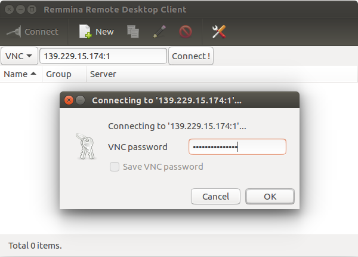

Testing the Pipeline
####################

We have set up a server that you can access using VNC. You can test it on your
own data or the data we have provided for test. Also, you can test it on your
own machine but we can't give you support, although we provide
full documentation for installing and testing it.

Short Pipeline Overview
***********************
The Goodman Pipeline is distributed as a single package but the full process is
split in two: ``redccd`` and ``redspec``. The first does the 2D image reduction,
going from raw data to flatfielded data, and the second (``redspec``) takes a 2D
image containing one or more spectrum and creates a wavelength calibrated 1D
spectrum.

VPN Connection
**************
If you are connecting from outside AURA you must connect through the VPN
if you don't have the information, ask your *support scientist* to provide it
for you.

VNC Connection
**************
The server is ``soardata3`` IP Address ``139.229.15.174`` and the vnc password
is ``vnc4goodmanpipe``.

Using the Terminal
^^^^^^^^^^^^^^^^^^
Open a terminal, and assuming you have installed ``vncviewer``.

    ``vncviewer soardata3:1``

You will be asked to type in the *password* provided above.

Using Graphical VNC Clients
^^^^^^^^^^^^^^^^^^^^^^^^^^^
Using a graphical VNC client is quite similar and intuitive

In this case the *IP address* was used, which is equivalent and sometimes better.

Getting Help
************
The Goodman Pipeline comes with full documentation and you can get help by using
the ``--help`` argument. For instance:

For ``redccd``::

    bash$ redccd --help
    usage: redccd [-h] [--cosmic] [--ignore-bias] [--auto-clean]
                  [--saturation <Value>] [--raw-path raw_path]
                  [--red-path red_path] [--debug] [--log-to-file]
                  [--flat-normalize <Normalization Method>]
                  [--flat-norm-order <Order>] [--dcr-par-dir <dcr.par directory>]
                  [--keep-cosmic-files]

    Goodman CCD Reduction - CCDreductions for Goodman spectroscopic data

    optional arguments:
      -h, --help            show this help message and exit
      --cosmic              Clean cosmic rays from science data.
      --ignore-bias         Ignore bias correction
      --auto-clean          Automatically clean reduced data directory
      --saturation <Value>  Saturation limit. Default to 55.000 ADU (counts)
      --raw-path raw_path   Path to raw data.
      --red-path red_path   Path to reduced data.
      --debug               Show detailed information of the process.
      --log-to-file         Write log to a file.
      --flat-normalize <Normalization Method>
                            Choose a method to normalize the master flat
                            forspectroscoy. Choices are: mean, simple (model) and
                            full (fits model to each line).
      --flat-norm-order <Order>
                            Defines the order of the model to be fitted.
      --dcr-par-dir <dcr.par directory>
                            Directory of default dcr.par file.
      --keep-cosmic-files   After cleaning cosmic rays with dcr, do not remove the
                            input file and the cosmic rays file.

And for ``redspec``::

    bash$ redspec --help
    usage: redspec [-h] [--data-path <Source Path>]
                   [--proc-path <Destination Path>]
                   [--search-pattern <Search Pattern>]
                   [--output-prefix <Out Prefix>] [--extraction <Extraction Type>]
                   [--reference-files <Reference Dir>] [--interactive] [--debug]
                   [--log-to-file] [--save-plots] [--plot-results]

    Extracts goodman spectra and does wavelength calibration.

    optional arguments:
      -h, --help            show this help message and exit
      --data-path <Source Path>
                            Path for location of raw data. Default <./>
      --proc-path <Destination Path>
                            Path for destination of processed data. Default <./>
      --search-pattern <Search Pattern>
                            Pattern for matching the goodman's reduced data.
      --output-prefix <Out Prefix>
                            Prefix to add to calibrated spectrum.
      --extraction <Extraction Type>
                            Choose a which extraction to perform. Simple is a sum
                            across the spatial direction after the background has
                            been removed. Optimal is a more advanced method that
                            considers weights and profilefitting.
      --reference-files <Reference Dir>
                            Directory of Reference files location
      --interactive         Interactive wavelength solution.Disbled by default.
      --debug               Debugging Mode
      --log-to-file         Write log to a file
      --save-plots          Save all plots in a directory
      --plot-results        Show wavelength calibrated spectrum at the end.

Running the Pipeline
********************
The pipeline is designed to work even if you put no arguments but this not always
the best. For well behaved data this might be useful or if you have a large
survey with data obtained in an ordered and systematic way.

redccd
^^^^^^
For ``redccd`` I suggest using ``--cosmic`` and ``auto-clean`` also you might
want to consider ``--saturation <new value>`` to change the saturation level if
you get all your flats rejected due to saturation. Sometimes there is a hot column
at the end that produced very high values.

    ``redccd --cosmic --auto-clean``

In case you want to use ``--saturation`` here is an example:

    ``redccd --cosmic --auto-clean --saturation 70000``

This changes the saturation level to `70000 ADU`` in this context the saturation
value works as a threshold for rejecting images.

By default, ``redccd`` puts reduced data in a subdirectory ``RED``, you can
provide a different one by using ``--red-path``.

An image ``image_file.fits`` that has been fully (and propperly) processed should
have the new name (including the reduced data folder):

    ``cfzsto_image_file.fits``

Where ``c`` stands for *cosmic ray rejected*,  ``f`` for flatfielded, ``z``
for zero or bias corrected, ``s`` for slit trimmed, ``t`` for trimmed and ``o``
for overscan corrected.

redspec
^^^^^^^
By default ``redspec`` will search for images with the prefix ``cfzsto`` in case
you have produced a different prefix you can change it by using ``--search-pattern``

You can just run ``redspec`` in case everything is the default but if this is
the first time you run the pipeline I suggest:

    ``redspec --plot-results``

In that way two important plots will be shown full screen, the comparison lamp
fitted to a reference comparison lamp and some values for the wavelength solution
fit and the extracted spectrum plotted with the wavelength solution.

