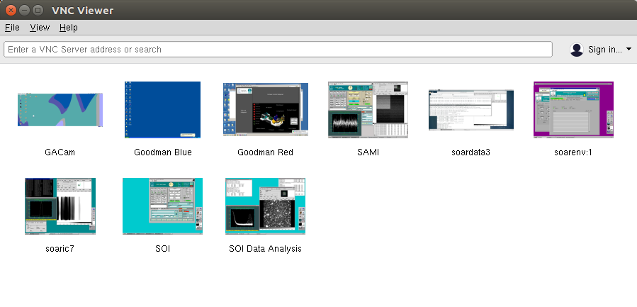
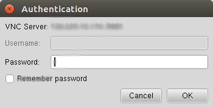

.. _`Running Pipeline`:

Running the pipeline in the SOAR data reduction computer
########################################################

The Goodman Spectroscopic Data Reduction Pipeline has been installed on a
dedicated computer at SOAR. The procedure is to open a VNC session, for which
you need to be connected to the SOAR VPN. The credentials for the VPN are the
same you used for your observing run, provided by your *Support Scientist*, who
will also give you the information for the data reduction computer VNC
connection.

.. note:: IRAF is available in all three data servers. Running ``iraf`` will
    open an *xgterm* and *ds9* windows. ``iraf-only`` will not open *ds9*

Establish a VNC connection
**************************
Separately, you should receive a server hostname, IP, display number and
VNC-password. If you don't you can ask for it. We have decided to use a similar
organization of vnc displays as for ``soaric7``:

.. table:: VNC display number and working folder assigned to each partner.

   ========= ===================== ====================================
    Display    Partner/Institution     Folder
   ========= ===================== ====================================
       :1      NOAO                  ``/home/goodman/data/NOAO``
       :2      Brazil                ``/home/goodman/data/BRAZIL``
       :3      UNC                   ``/home/goodman/data/UNC``
       :4      MSU                   ``/home/goodman/data/MSU``
       :5      Chile                 ``/home/goodman/data/CHILE``
   ========= ===================== ====================================

For the rest of this tutorial we will assume your host name is ``vnc-server``
the display number  is ``1`` and your password is ``password``.
Though we recommend using RealVNC, most other VNC clients will work fine (e.g.,
Remmina in Linux). For GNU/Linux and Mac OSX machines we suggest the RealVNC
Viewer client. For Windows machines, we suggest either the RealVNC Viewer client
or the UltraVNC viewer client.
We also know that Vinagre and vncviewer on GNU/Linux work fine.

VNC from the Terminal
^^^^^^^^^^^^^^^^^^^^^
Open a terminal, and assuming you have installed ``vncviewer``.

    ``vncviewer vnc-server:1``

You will be asked to type in the *password* provided.

VNC using a Graphical Client
^^^^^^^^^^^^^^^^^^^^^^^^^^^^
Using a graphical VNC client is quite similar and intuitive

In this case the *IP address* was used, which is equivalent and sometimes
better.

Dealing with Virtual Environments
*********************************

The Goodman Spectroscopic Pipeline uses virtual environments since they allow
for easy portability and also give a higher level of safety for the host system.
If you know nothing about them, we encourage you to do a quick search to get at
least the basics.

All terminals using bash are configured to start with the appropriate virtual
environment activated by default. The default virtual environment is called
``astroconda``.

If for any reason it is not activated you will need to activate it in order to
use the pipeline.

``source activate astroconda``

Or if for some reason you need to deactivate it, with the virtual environment
activated you do:

``source deactivate``

.. raw:: pdf

    PageBreak

Running the Pipeline
********************

1. Open a Terminal

2. Go to ``/home/goodman/data``

      ``cd /home/goodman/data``

3. Here you have a workspace to put your data according to your institution.

   .. image:: img/screenshot_1.png
       :width: 1200px

4. Create a data folder inside your workspace.

      ``cd NOAO``

      ``mkdir 2017-07-05``

      ``cd 2017-07-05``

5. Copy your data from Goodman Computer

       ``scp observer@soaric7:/home3/observer/GOODMAN_DATA/NOAO/2017-07-05/ ./``

6. Make sure you have a full data set. At this point your observing logs will
   become very useful, eliminate focus sequence, aquisition exposure and any
   other file present that will not be needed for the processing. The following
   list summarizes the kind of data that you need to fully process your data.

    - BIAS: Bias
    - FLAT: Flats
    - COMP: Comparison Lamps
    - OBJECT: Science Frames

   Also make sure your data has the same *readout speed*, *binning*, and *ROI*.
   If you used different configurations during the same night, we recommend you
   to set up a separate folder for each.

7. Run ``redccd``:

   If you are running ``redccd`` for the first time you can use ``redccd`` alone
   but if it's a second or third time you will need to use ``--auto-clean``
   which is a built-in protection for your data, in case you don't want to
   delete what has been done. Also you might want to consider
   ``--saturation <new value>`` to change the saturation level if you get all
   your flats rejected due to saturation. Sometimes there is a hot column at the
   end that produced very high values.

       ``redccd --auto-clean``

   In case you want to use ``--saturation`` here is an example:

       ``redccd --auto-clean --saturation 70000``

   This changes the saturation level to ``70000 ADU`` in this context
   the saturation value works as a threshold for rejecting images and it varies
   from one instrument configuration to another.

   By default, ``redccd`` puts reduced data in a subdirectory ``RED``, you can
   provide a different one by using ``--red-path``.

   An image ``image_file.fits`` that has been fully (and properly) processed should
   have the new name (including the reduced data folder ``RED``):

       ``RED/cfzsto_image_file.fits``

8. Run ``redspec``:

   All data processed with the ``redccd`` (previous step) will be saved in a
   separate folder this was intentionally made this way in order to avoid
   overwriting your original data.

   First, move to the folder were the data was stored.

   ``cd RED``

   By default ``redspec`` will search for images with the prefix ``cfzsto``, in case
   you have produced a different prefix you can change it by using ``--search-pattern``

   You can just run ``redspec`` in case everything is the default but if this is
   the first time you run the pipeline we suggest:

       ``redspec --plot-results``

   In that way two important plots will be shown full screen, the comparison lamp
   fitted to a reference comparison lamp and some values for the wavelength solution
   fit and the extracted spectrum plotted with the wavelength solution.

   Before the wavelength solution is calculated, the extracted spectrum (1D already)
   is saved with an ``e`` as prefix. The final image has a ``w`` added to the
   start of the name, following the above example your final 1D and wavelength
   calibrated image will be named:

      ``wecfzsto_image_file.fits``

9. Finally, review the results. Below is a table with the definition of all
   letters used in the construction of the prefix.

   The meaning of every letter in ``wecfzsto`` is summarized in the following table:

   +--------+-----------------------------------------------------------------------+
   | Letter | Meaning                                                               |
   +========+=======================================================================+
   |    w   | Wavelength calibrated.                                                |
   +--------+-----------------------------------------------------------------------+
   |    e   | Extracted spectrum, 1D, no wavelength solution.                       |
   +--------+-----------------------------------------------------------------------+
   |    c   | Cosmic ray cleaned or mask created depending on the method.           |
   +--------+-----------------------------------------------------------------------+
   |    f   | Flat corrected.                                                       |
   +--------+-----------------------------------------------------------------------+
   |    z   | Zero or Bias corrected.                                               |
   +--------+-----------------------------------------------------------------------+
   |    s   | Slit trimmed, trims off the non-illuminated sections of the detector. |
   +--------+-----------------------------------------------------------------------+
   |    t   | Initial Image trimming.                                               |
   +--------+-----------------------------------------------------------------------+
   |    o   | Overscan corrected.                                                   |
   +--------+-----------------------------------------------------------------------+

