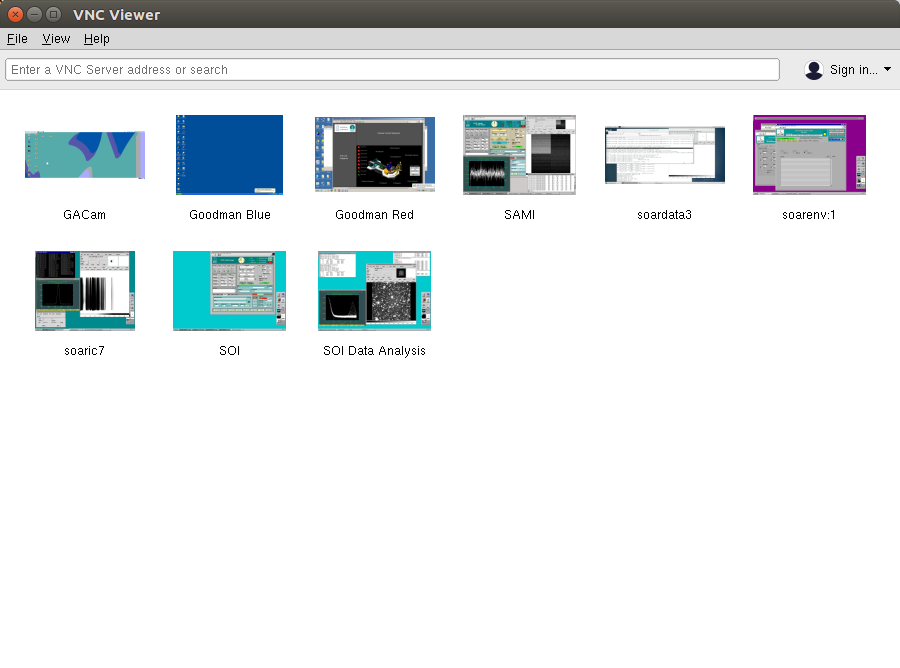
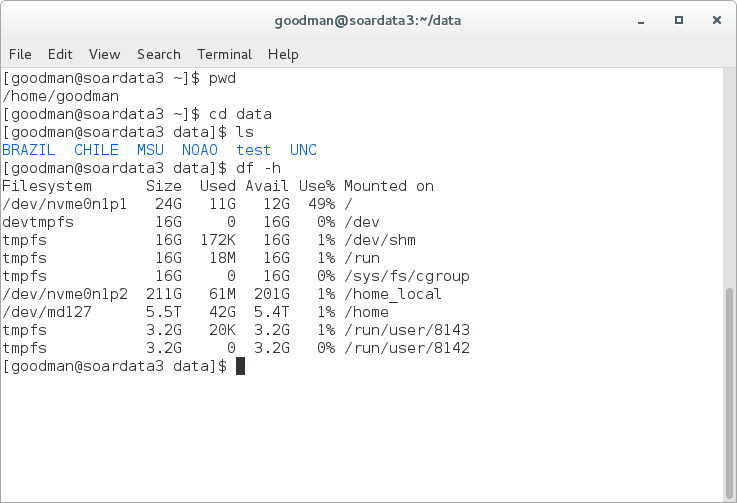

General Considerations on using the pipeline
############################################
The Goodman Spectroscopic Pipeline is meant to work as a single package. However, the full process is
split in two separate modules: ``redccd`` and ``redspec``. The first does the basic 2D image reduction,
applying bias and flat field corrections, and cosmic ray removal. The second module, ``redspec``,
takes the corrected 2D images output by ``redccd`` and produces wavelength-calibrated 1D spectra.

The pipeline is run from the command line in a terminal window. Each module is run separately, first
``redccd`` followed by ``redspec``, however, you could run both sequentially from e.g. a shell script.

In order to facilitate things you should organize your data:

 1. Make sure all the data in your folder corresponds to the same binning, readout mode,
    region of interest (ROI), and grating/wavelength mode combination.
 2. You should have bias, flats (quartz or dome flats), and the appropriate comparison lamps.
    Other files like acquisition images, slit images and focus images should be deleted.

Command line arguments
**********************
For a list of the options and command line arguments type ``--help`` argument:

For ``redccd``::

    bash$ redccd --help
    usage: redccd [-h] [--cosmic] [--ignore-bias] [--auto-clean]
                  [--saturation <Value>] [--raw-path raw_path]
                  [--red-path red_path] [--debug] [--log-to-file]
                  [--flat-normalize <Normalization Method>]
                  [--flat-norm-order <Order>] [--dcr-par-dir <dcr.par directory>]
                  [--keep-cosmic-files]

    Goodman CCD Reduction - CCDreductions for Goodman spectroscopic data

    optional arguments:
      -h, --help            show this help message and exit
      --cosmic              Clean cosmic rays from science data.
      --ignore-bias         Ignore bias correction
      --auto-clean          Automatically clean reduced data directory
      --saturation <Value>  Saturation limit. Default to 55.000 ADU (counts)
      --raw-path raw_path   Path to raw data.
      --red-path red_path   Path to reduced data.
      --debug               Show detailed information of the process.
      --log-to-file         Write log to a file.
      --flat-normalize <Normalization Method>
                            Choose a method to normalize the master flat
                            forspectroscoy. Choices are: mean, simple (model) and
                            full (fits model to each line).
      --flat-norm-order <Order>
                            Defines the order of the model to be fitted.
      --dcr-par-dir <dcr.par directory>
                            Directory of default dcr.par file.
      --keep-cosmic-files   After cleaning cosmic rays with dcr, do not remove the
                            input file and the cosmic rays file.

And for ``redspec``::

    bash$ redspec --help
    usage: redspec [-h] [--data-path <Source Path>]
                   [--proc-path <Destination Path>]
                   [--search-pattern <Search Pattern>]
                   [--output-prefix <Out Prefix>] [--extraction <Extraction Type>]
                   [--reference-files <Reference Dir>] [--interactive] [--debug]
                   [--log-to-file] [--save-plots] [--plot-results]

    Extracts goodman spectra and does wavelength calibration.

    optional arguments:
      -h, --help            show this help message and exit
      --data-path <Source Path>
                            Path for location of raw data. Default <./>
      --proc-path <Destination Path>
                            Path for destination of processed data. Default <./>
      --search-pattern <Search Pattern>
                            Pattern for matching the goodman's reduced data.
      --output-prefix <Out Prefix>
                            Prefix to add to calibrated spectrum.
      --extraction <Extraction Type>
                            Choose a which extraction to perform. Simple is a sum
                            across the spatial direction after the background has
                            been removed. Optimal is a more advanced method that
                            considers weights and profilefitting.
      --reference-files <Reference Dir>
                            Directory of Reference files location
      --interactive         Interactive wavelength solution.Disbled by default.
      --debug               Debugging Mode
      --log-to-file         Write log to a file
      --save-plots          Save all plots in a directory
      --plot-results        Show wavelength calibrated spectrum at the end.

.. _`Using Pipeline`:

Running the pipeline in the SOAR data reduction computer
########################################################

The Goodman Spectroscopic Data Reduction Pipeline has been installed on a dedicated computer
at SOAR. The procedure is to open a VNC session, for which you need to be connected to the SOAR VPN.
The credentials for the VPN are the same you used for your observing run,
provided by your *Support Scientist*, who will also give you the information for the
data reduction computer VNC connection.

Establish a VNC connection
**************************
For the rest of this tutorial we will assume your host name is ``vnc-server``
the display is ``1`` and your password is ``password``.
Though we recommend using RealVNC, most other VNC clients will work fine (e.g., Remmina in Linux).
For GNU/Linux and Mac OSX machines we suggest the RealVNC Viewer client.
For Windows machines, we suggest either the RealVNC Viewer client or the UltraVNC viewer client.
We also know that Vinagre and vncviewer on GNU/Linux work fine.

VNC from the Terminal
^^^^^^^^^^^^^^^^^^
Open a terminal, and assuming you have installed ``vncviewer``.

    ``vncviewer vnc-server:1``

You will be asked to type in the *password* provided above.

VNC using a Graphical Client
^^^^^^^^^^^^^^^^^^^^^^^^^^^^
Using a graphical VNC client is quite similar and intuitive

.. image:: img/realvnc_login.png
    :width: 800px

In this case the *IP address* was used, which is equivalent and sometimes better.

Running the Pipeline
********************

1. Open a Terminal

2. Go to ``/home/goodman/data``

    ``cd /home/goodman/data``

3. Here you have a workspace to put your data according to your institution.

4. Create a data folder inside your workspace.

    ``cd NOAO``

    ``mkdir 2017-07-05``

    ``cd 2017-07-05``

5. Copy your data from Goodman Computer

    ``scp observer@soaric7:/home3/observer/GOODMAN_DATA/NOAO/2017-07-05/ ./``

6. Make sure you have a full data set. At this point your observing logs will
 become very useful, eliminate focus sequence, aquisition exposure and any other
 file present that will not be needed for the processing. The following list
 summarizes the kind of data that you need to fully process your data.

    - BIAS: Bias
    - FLAT: Flats
    - COMP: Comparison Lamps
    - OBJECT: Science Frames

 Also make sure your data has the same *readout speed*, *binning*, and *ROI*. If
 you used different configurations during the same night, we recommend you to
 set up a separate folder for each.

7. Run ``redccd``:

 For ``redccd`` I suggest using ``--cosmic`` and ``auto-clean`` also you might
 want to consider ``--saturation <new value>`` to change the saturation level if
 you get all your flats rejected due to saturation. Sometimes there is a hot column
 at the end that produced very high values.

     ``redccd --cosmic --auto-clean``

 In case you want to use ``--saturation`` here is an example:

     ``redccd --cosmic --auto-clean --saturation 70000``

 This changes the saturation level to `70000 ADU`` in this context the saturation
 value works as a threshold for rejecting images.

 By default, ``redccd`` puts reduced data in a subdirectory ``RED``, you can
 provide a different one by using ``--red-path``.

 An image ``image_file.fits`` that has been fully (and propperly) processed should
 have the new name (including the reduced data folder):

     ``cfzsto_image_file.fits``

 Where ``c`` stands for *cosmic ray rejected*,  ``f`` for flatfielded, ``z``
 for zero or bias corrected, ``s`` for slit trimmed, ``t`` for trimmed and ``o``
 for overscan corrected.

8. Run ``redspec``:

 By default ``redspec`` will search for images with the prefix ``cfzsto`` in case
 you have produced a different prefix you can change it by using ``--search-pattern``
 
 You can just run ``redspec`` in case everything is the default but if this is
 the first time you run the pipeline I suggest:
 
     ``redspec --plot-results``
 
 In that way two important plots will be shown full screen, the comparison lamp
 fitted to a reference comparison lamp and some values for the wavelength solution
 fit and the extracted spectrum plotted with the wavelength solution.

Troubleshooting
***************

- The wavelength Solutions is way off: Check that the lamp was correctly
registered in the header. Also check that the corresponding reference lamp exist.