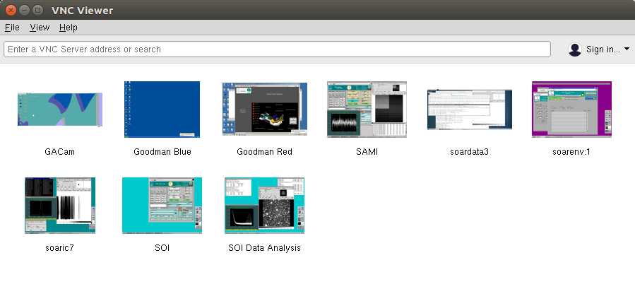
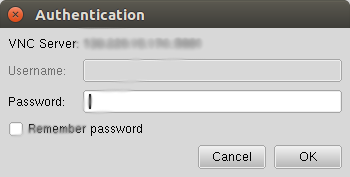

General Considerations on using the pipeline
############################################
The Goodman Spectroscopic Pipeline is meant to work as a single package.
However, the full process is split in two separate modules: ``redccd`` and
``redspec``. The first does the basic 2D image reduction, applying bias and flat
field corrections, and cosmic ray removal. The second module, ``redspec``, takes
the corrected 2D images output by ``redccd`` and produces wavelength-calibrated
1D spectra.

The pipeline is run from the command line in a terminal window. Each module is
run separately, first ``redccd`` followed by ``redspec``, however, you could
run both sequentially from e.g. a shell script.

In order to make things easier you should organize your data:

1. Make sure all the data in your folder corresponds to the same binning,
   readout mode, region of interest (ROI), and grating/wavelength mode
   combination.
2. You should have bias, flats (quartz or dome flats), and the appropriate
   comparison lamps. Other files like acquisition images, slit images and focus
   images should be deleted.
3. Do not mix dome flats with quartz lamp flats. As an example, suppose I took
   both quartz lamps and dome flats for my targets. I could create two folders,
   one with the science data and the dome flats, and another with the same
   science data and the quartz lamps. Then, if I run the pipeline in each
   folder I can compare the results and decide which type of flat works best
   for my particular case.

Command line arguments
**********************
For a list of the options and command line arguments type ``--help`` argument:

For ``redccd``

.. literalinclude:: files/redccd_help.txt

And for ``redspec``

.. literalinclude:: files/redspec_help.txt

.. raw:: pdf

    PageBreak

Lists of Reference Lamps Available
**********************************

The automatic wavelength calibration relies on having previously calibrated
reference lamps obtained in the same configuration or mode. It is also important
that the lamp names are correct, for instance ``HgAr`` is quite different than
``HgArNe``. For interactive wavelength calibration, reference lamps are used as
a visual aid only. It lets you find the matching laboratory lines values that
will be used to fit a pixel to wavelength relation that we call
*Wavelength Solution* The list of lamps is the following.

   +---------+------+--------+--------+
   | Grating | Mode | Filter |  Lamp  |
   +=========+======+========+========+
   |   400   |  M1  | None   | HgAr   |
   +---------+------+--------+--------+
   |   400   |  M1  | None   | HgArNe |
   +---------+------+--------+--------+
   |   400   |  M2  | GG455  | HgAr   |
   +---------+------+--------+--------+
   |   400   |  M2  | GG455  | HgArNe |
   +---------+------+--------+--------+
   | 600-old | Blue | None   | HgAr   |
   +---------+------+--------+--------+
   | 600-old | Blue | None   | CuHeAr |
   +---------+------+--------+--------+
   |  1200   |  M2  | None   | CuHeAr |
   +---------+------+--------+--------+
   |  1200   |  M3  | None   | CuHeAr |
   +---------+------+--------+--------+
   |  1200   |  M5  | GG455  | CuHeAr |
   +---------+------+--------+--------+

Adding new reference lamps
**************************

It is possible to add new lamps very easily you just need a raw lamp that meets
the following specifications with respect to your science project:

   - Same instrument configuration or mode
   - Same Grating
   - Same order blocking filter if present
   - Same binning
   - Same lamp/combination that you use in your observations
   - Smallest slit possible. Equal is OK too.

Then you can use the interactive mode or other software (such as IRAF) to produce
a wavelength-calibrated 1D spectrum. Now you have to options, identify the
system folder where the lamps that come with the package are saved and simply
put it there or put it in another directory and use the argument ``--reference-files``

   ``redspec --reference-files /path/to/ref-lamp-location``

Or send it to me and I will make it available as a package filea.

.. _`Using Pipeline`:

Running the pipeline in the SOAR data reduction computer
########################################################

The Goodman Spectroscopic Data Reduction Pipeline has been installed on a
dedicated computer at SOAR. The procedure is to open a VNC session, for which
you need to be connected to the SOAR VPN. The credentials for the VPN are the
same you used for your observing run, provided by your *Support Scientist*, who
will also give you the information for the data reduction computer VNC
connection.

Establish a VNC connection
**************************
Separately, you should receive a server hostname, IP, port and VNC-password. If
you don't you can ask for it. We have decided to use a similar organization of
vnc desktops:

.. table:: VNC ports and working folder assigned to each partner.
   :align: center
   :widths: auto

   ========= ===================== ====================================
      Port    Partner/Institution     Folder
   ========= ===================== ====================================
       :1      NOAO                  ``/home/goodman/data/NOAO``
       :2      Brazil                ``/home/goodman/data/BRAZIL``
       :3      UNC                   ``/home/goodman/data/UNC``
       :4      MSU                   ``/home/goodman/data/MSU``
       :5      Chile                 ``/home/goodman/data/CHILE``
   ========= ===================== ====================================

For the rest of this tutorial we will assume your host name is ``vnc-server``
the port is ``1`` and your password is ``password``.
Though we recommend using RealVNC, most other VNC clients will work fine (e.g.,
Remmina in Linux). For GNU/Linux and Mac OSX machines we suggest the RealVNC
Viewer client. For Windows machines, we suggest either the RealVNC Viewer client
or the UltraVNC viewer client.
We also know that Vinagre and vncviewer on GNU/Linux work fine.

VNC from the Terminal
^^^^^^^^^^^^^^^^^^^^^
Open a terminal, and assuming you have installed ``vncviewer``.

    ``vncviewer vnc-server:1``

You will be asked to type in the *password* provided.

VNC using a Graphical Client
^^^^^^^^^^^^^^^^^^^^^^^^^^^^
Using a graphical VNC client is quite similar and intuitive

In this case the *IP address* was used, which is equivalent and sometimes
better.

Running the Pipeline
********************

1. Open a Terminal

2. Go to ``/home/goodman/data``

      ``cd /home/goodman/data``

3. Here you have a workspace to put your data according to your institution.

   .. image:: img/screenshot_1.png
       :width: 1200px

4. Create a data folder inside your workspace.

      ``cd NOAO``

      ``mkdir 2017-07-05``

      ``cd 2017-07-05``

5. Copy your data from Goodman Computer

       ``scp observer@soaric7:/home3/observer/GOODMAN_DATA/NOAO/2017-07-05/ ./``

6. Make sure you have a full data set. At this point your observing logs will
   become very useful, eliminate focus sequence, aquisition exposure and any
   other file present that will not be needed for the processing. The following
   list summarizes the kind of data that you need to fully process your data.

    - BIAS: Bias
    - FLAT: Flats
    - COMP: Comparison Lamps
    - OBJECT: Science Frames

   Also make sure your data has the same *readout speed*, *binning*, and *ROI*.
   If you used different configurations during the same night, we recommend you
   to set up a separate folder for each.

7. Run ``redccd``:

   For ``redccd`` I suggest using ``--cosmic`` and ``auto-clean`` also you might
   want to consider ``--saturation <new value>`` to change the saturation level
   if you get all your flats rejected due to saturation. Sometimes there is a
   hot column at the end that produced very high values.

       ``redccd --cosmic --auto-clean``

   In case you want to use ``--saturation`` here is an example:

       ``redccd --cosmic --auto-clean --saturation 70000``

   This changes the saturation level to `70000 ADU`` in this context
   the saturation value works as a threshold for rejecting images.

   By default, ``redccd`` puts reduced data in a subdirectory ``RED``, you can
   provide a different one by using ``--red-path``.
   
   An image ``image_file.fits`` that has been fully (and propperly) processed should
   have the new name (including the reduced data folder):
   
       ``cfzsto_image_file.fits``

   The meaning of every letter in ``cfzsto`` is summarized in the following table:

   +--------+-----------------------------------------------------------------------+
   | Letter | Meaning                                                               |
   +========+=======================================================================+
   |    c   | Cosmic ray cleaned or mask created depending on the method            |
   +--------+-----------------------------------------------------------------------+
   |    f   | Flat corrected                                                        |
   +--------+-----------------------------------------------------------------------+
   |    z   | Zero or Bias corrected                                                |
   +--------+-----------------------------------------------------------------------+
   |    s   | Slit trimmed, trims off the non-illuminated sections of the detector  |
   +--------+-----------------------------------------------------------------------+
   |    t   | Initial Image trimming                                                |
   +--------+-----------------------------------------------------------------------+
   |    o   | Overscan corrected                                                    |
   +--------+-----------------------------------------------------------------------+

8. Run ``redspec``:

   By default ``redspec`` will search for images with the prefix ``cfzsto``, in case
   you have produced a different prefix you can change it by using ``--search-pattern``

   You can just run ``redspec`` in case everything is the default but if this is
   the first time you run the pipeline I suggest:

       ``redspec --plot-results``

   In that way two important plots will be shown full screen, the comparison lamp
   fitted to a reference comparison lamp and some values for the wavelength solution
   fit and the extracted spectrum plotted with the wavelength solution.

   The final image has a ``g`` added to the start of the name, following the
   above example your final 1D and wavelength calibrated image will be named:

      ``gcfzsto_image_file.fits``

.. include:: interactive_mode.rst

Troubleshooting
***************

- The wavelength Solutions is way off: Check that the lamp was correctly
  registered in the header. Also check that the corresponding reference lamp exist.
  for instance is not the same to have ``HgArNe`` to ``HgAr``
- Can't detect any objects: Check that the keyword ``OBSTYPE`` is correct.
- The reference data plot, in interactive mode, doesn't show anything or only
  vertical dotted lines: The reference lamp doesn't exist for that configuration,
  since this is used only for visual reference sometimes it will display the same
  lamp but in other instrument configuration, this will not affect the quality
  of the solution.
